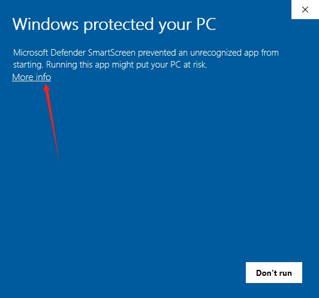
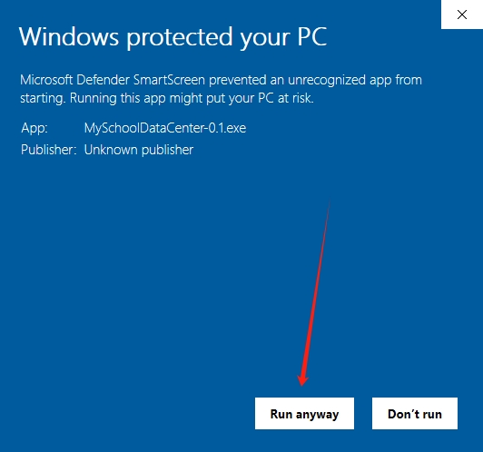
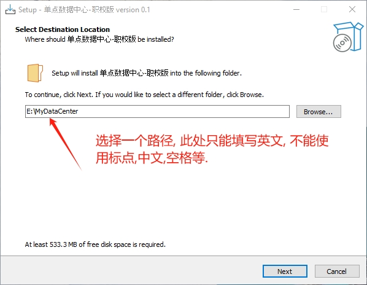
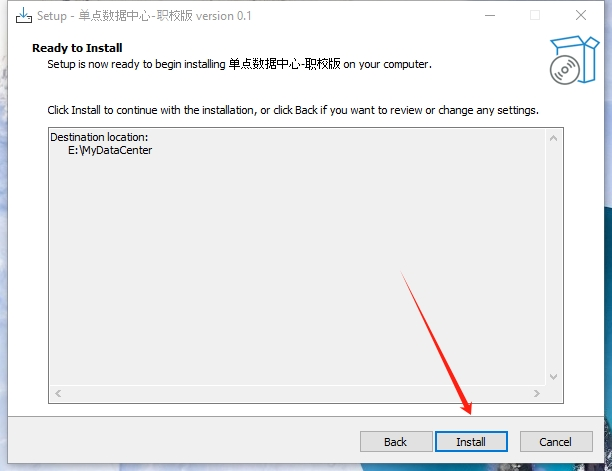
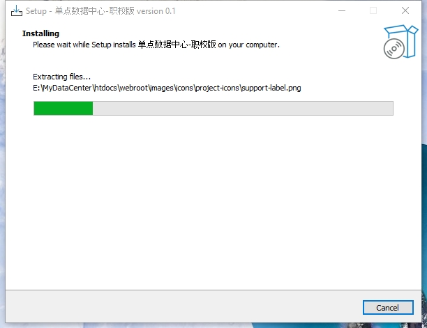
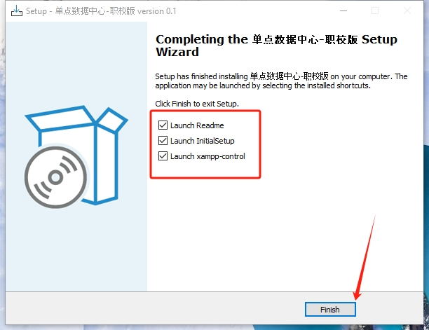
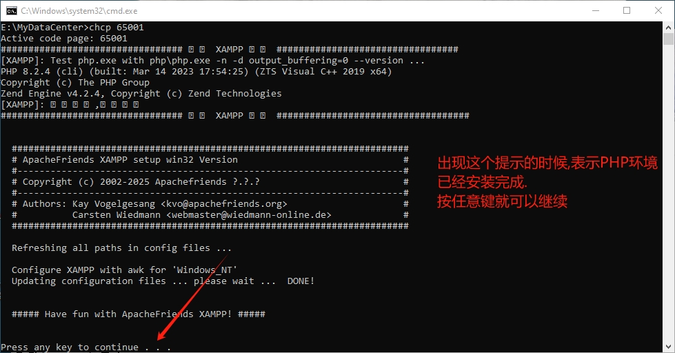
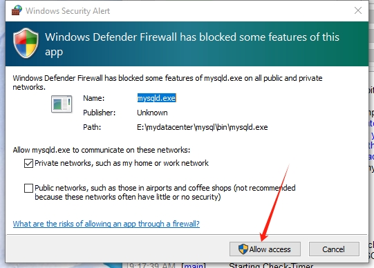
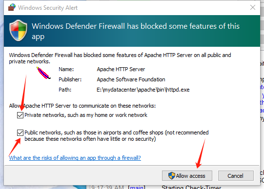
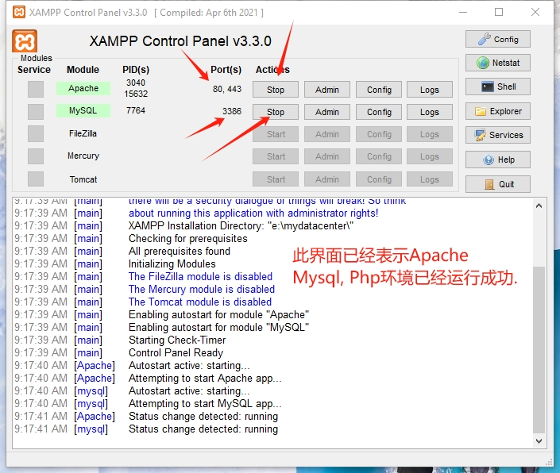

<a href="https://github.com/SmartSchoolAI/SchoolDataCenter/releases" target="_blank">点击下载Windows二进制安装包</a>

下面是Windows环境下面的安装过程:

双击EXE文件进行安装:

|  |  |
|------------------------------------------|------------------------------------------|
|  |  |
|  |  |
|  |  |
|  |  |
|  |  |
