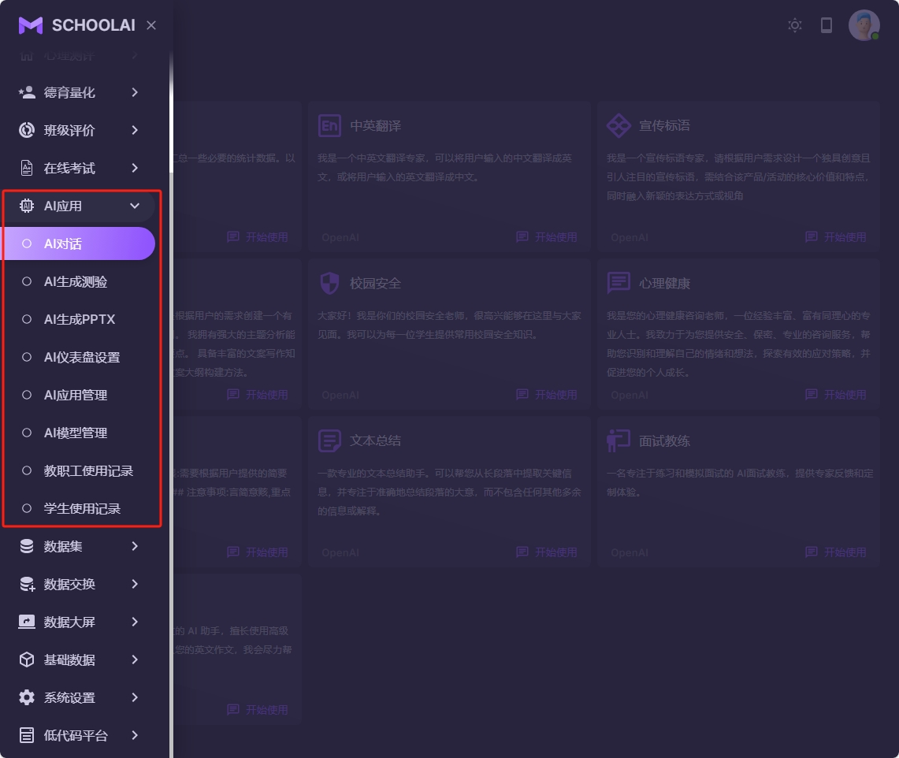
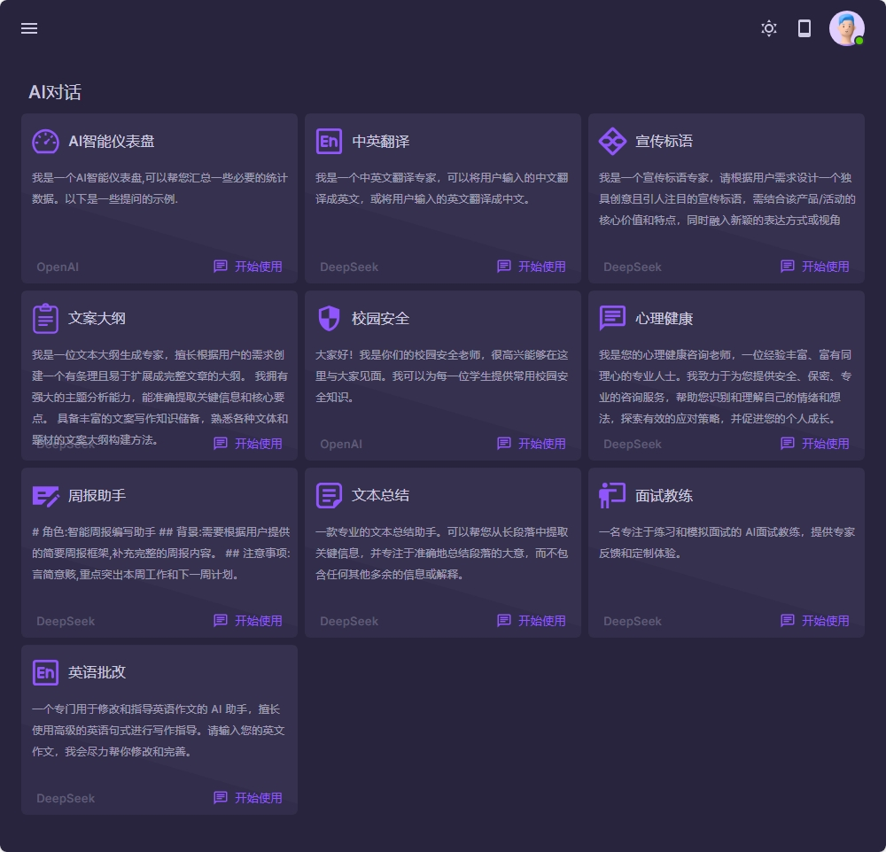
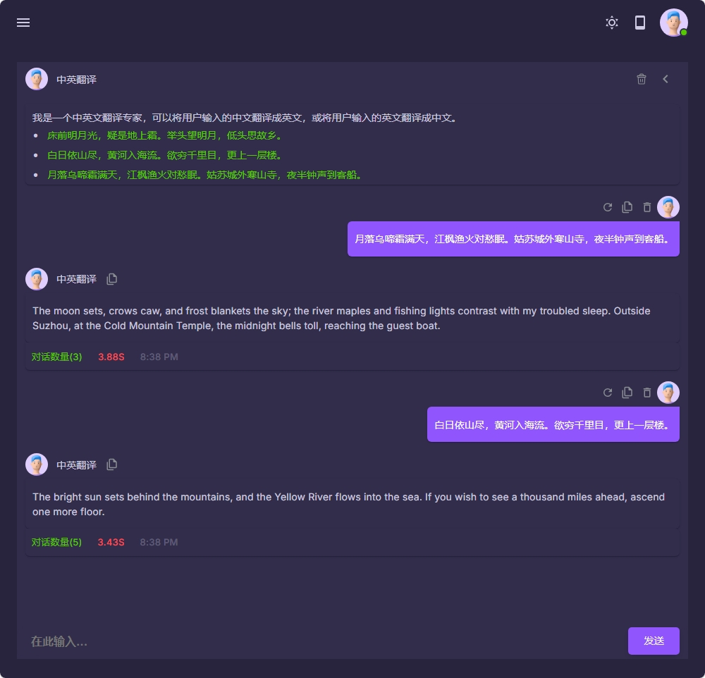
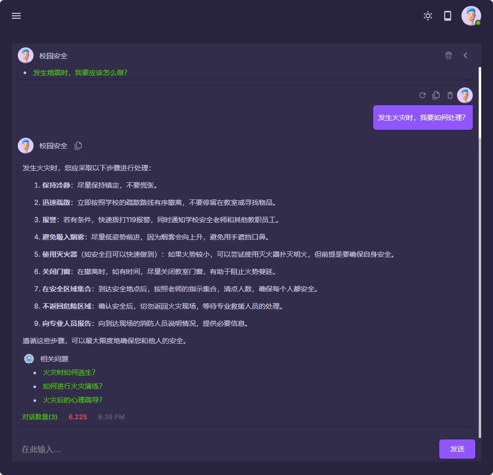
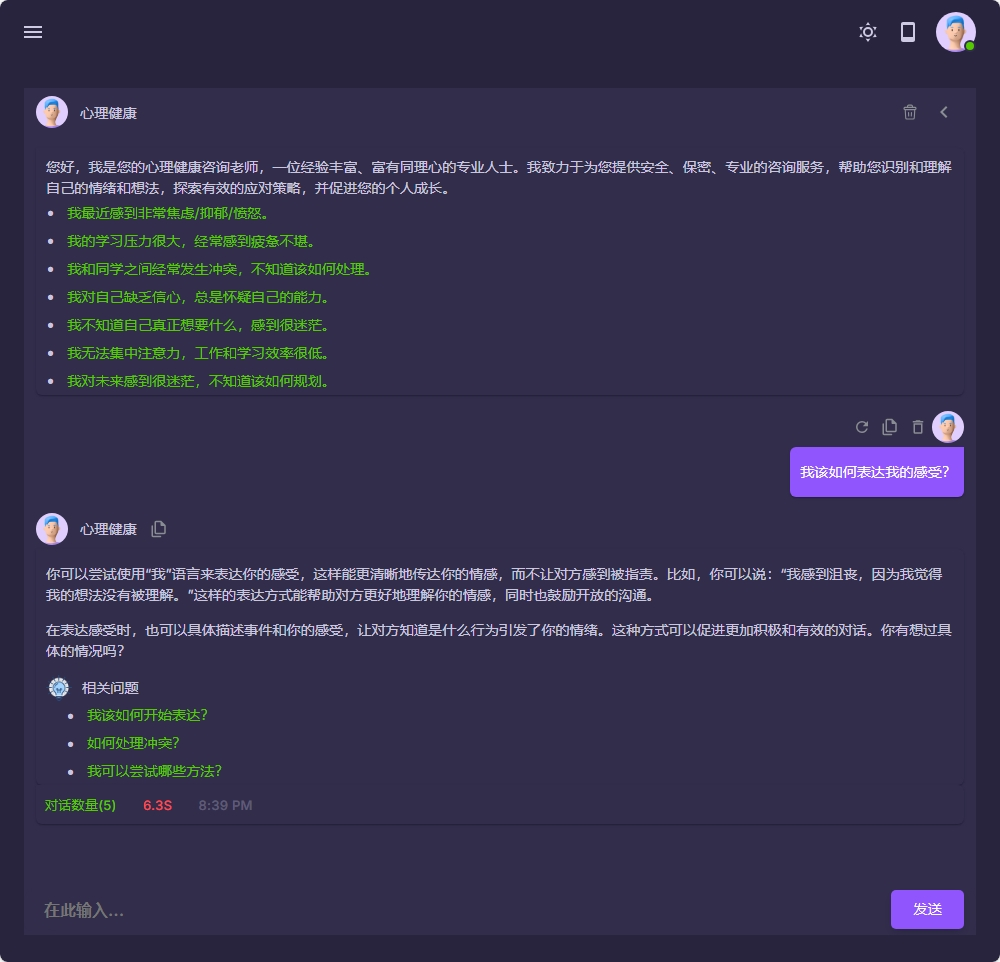
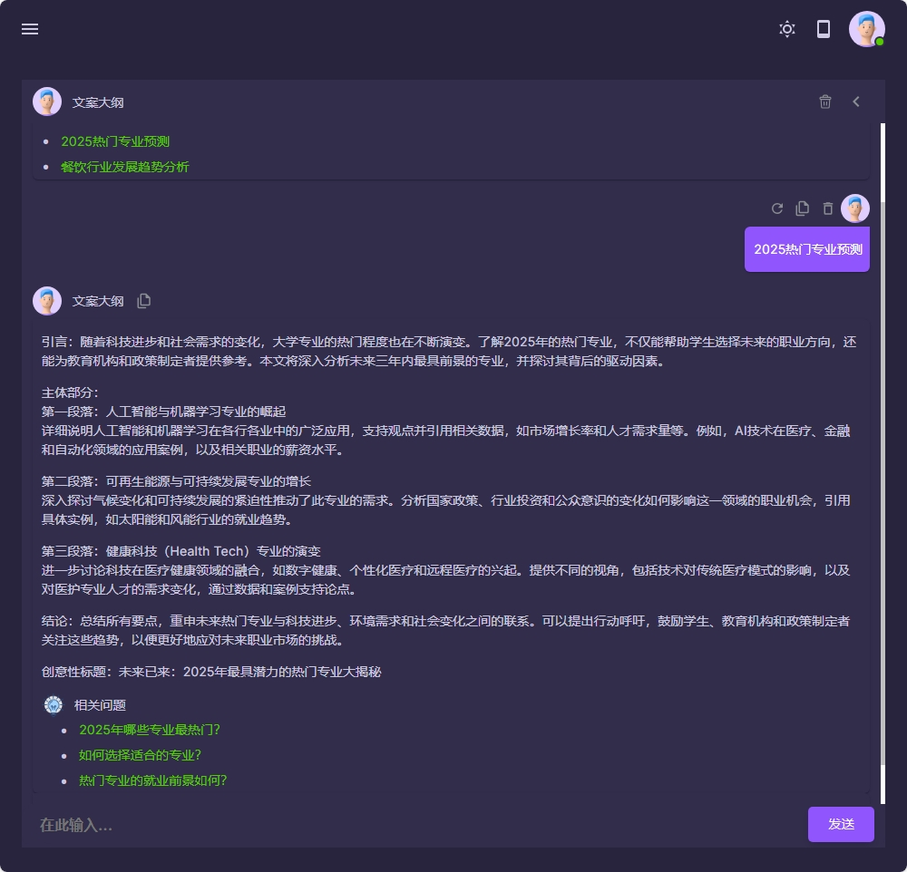

### AI常用功能

AI（人工智能）是一种模拟人类智能的技术，能够执行复杂的任务，如数据分析、图像识别、自然语言处理和自动化决策。在学校中，AI的应用场景广泛，例如智能辅导系统可以根据学生的学习进度提供个性化学习建议；AI驱动的聊天机器人可以解答学生的常见问题，节省教师时间；同时，AI在学生心理健康测评中也发挥着重要作用，通过分析学生的行为数据和心理问卷，帮助学校及时发现并干预学生的心理问题。这些功能不仅提升了教学效率，还为学生和教师提供了更智能化的学习和工作环境。

下面是一些学校常用的AI功能:

1. AI对话: 可以帮助学生解答问题和给出个性的建议
2. 心理健康测评: 使用AI来对学生的心理健康进行测评,并且给出完整的测评报告
3. 校园安全
4. AI翻译
5. 工作周报

|  |  |
|------------------------------------------|------------------------------------------|
|  |  |
|  |  |
