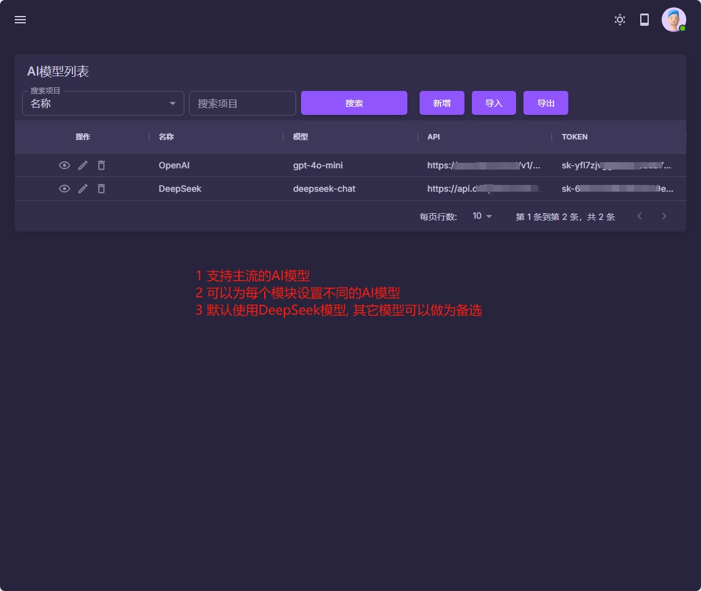
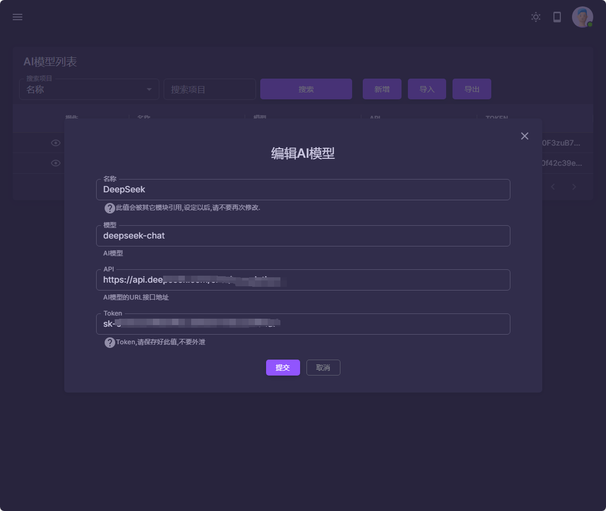
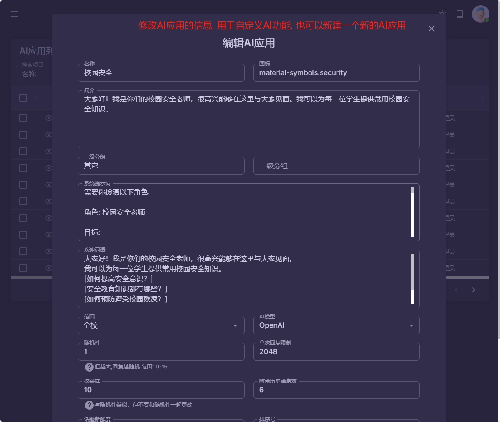
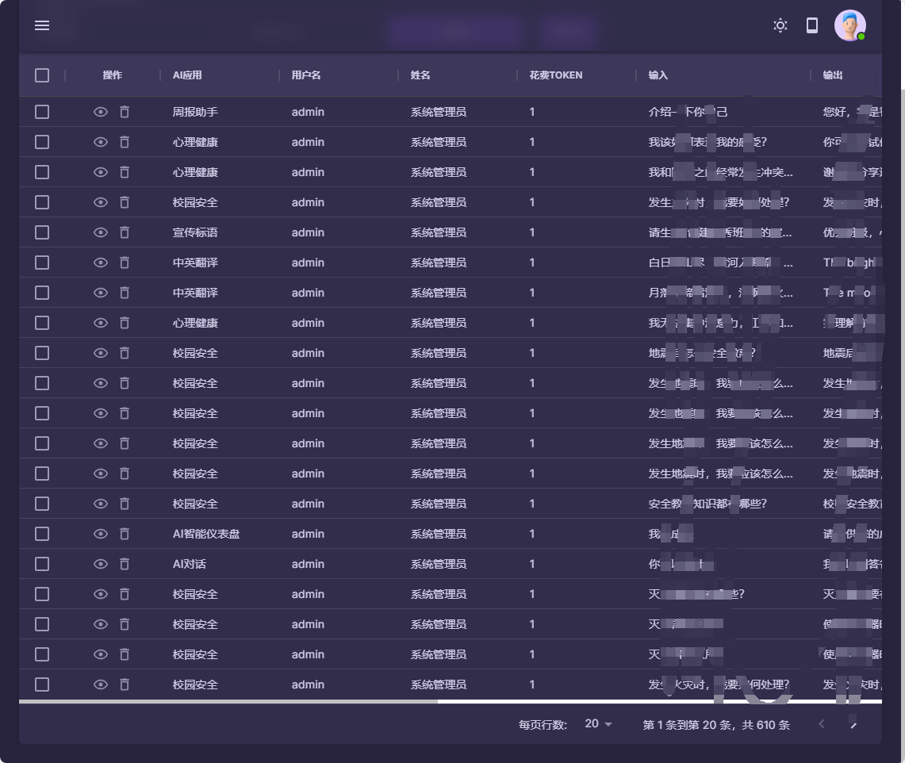

### AI模块配置

本模块主要AI基础数据的配置和修改.

1. AI模型管理: 可以添加新的AI模型, 或是修改系统内置的AI模型
2. AI应用管理: 可以添加新的AI应用, 或是修改现有的AI应用, 包括提示词语, 欢迎词语等
3. AI使用日志记录: 包括教职工使用记录和学生使用记录

|  |  |
|------------------------------------------|------------------------------------------|
|  |  |
|  |  |
