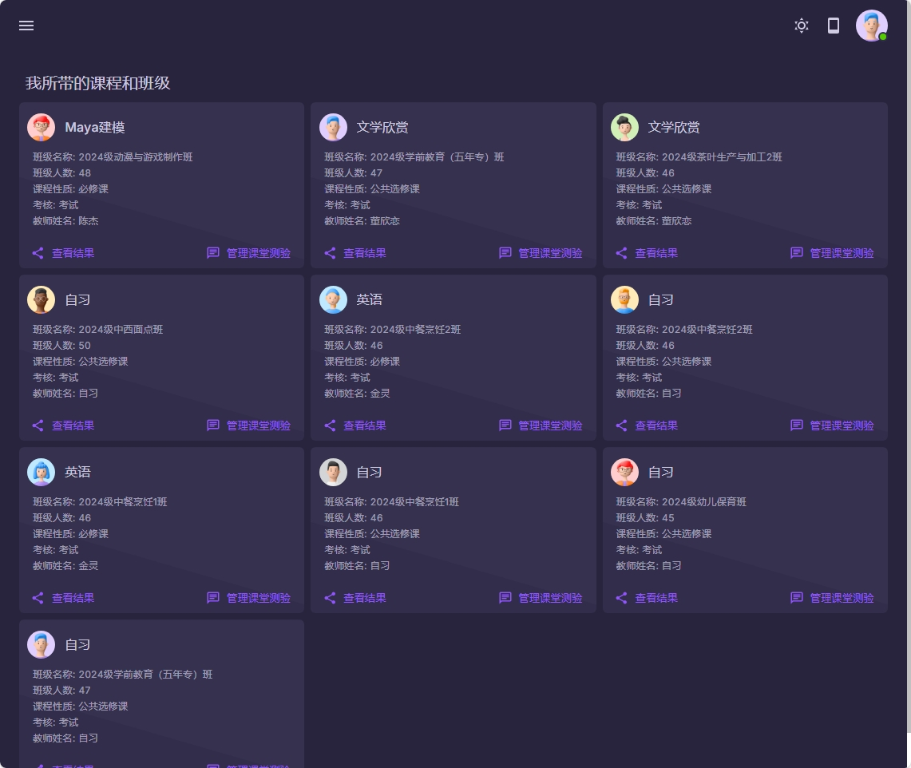
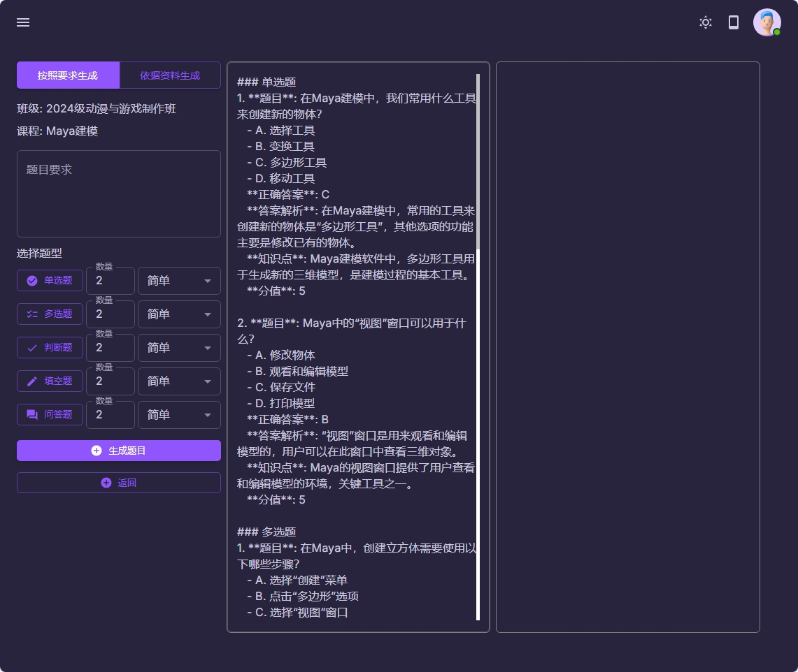

### AI生成课堂测验

可以按老师要求来生成不同的题目类型,生成的题目自动转入在线考试系统,供学生使用。

主要功能:
- 1 可以按题目要求,生成对应的题目
- 2 支持设置单选题,多选题,判断题目,填空题,问答题
- 3 每一种题目类型可以设置数量和难易程度
- 4 生成的题目可以在中间的区域进行预览
- 5 确定好的题目,可以自动转入在线考试系统,学生就可以来完成在线测验
- 6 如果有需要,这部分成绩,可以转入学生的平时成绩,从而在期末成绩中体现出来

- 7 此部分功能还没有开发完成, 后续会不断进行更新

|  |  |
|------------------------------------------|------------------------------------------|
