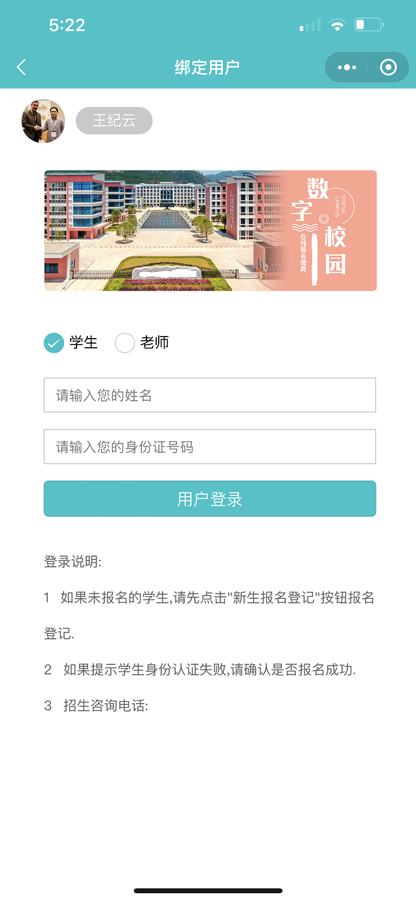
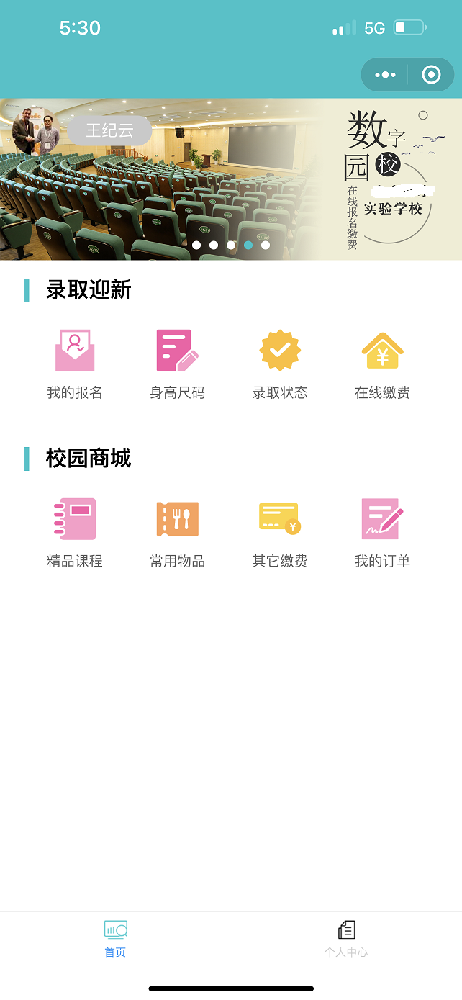
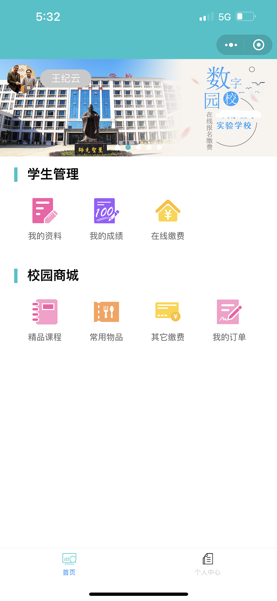

### 新生报名缴费
1.  本模块是属于定制开发功能,非标准功能
2.  主要适用于中小学的学生缴费
3.  适用场景为民办的中小学校,用于学生缴学费和各种杂费
4.  中职校的微信缴费是另外一种复杂的逻辑
5.  展示形式是微信小程序, 家长和老师都可以使用
6.  主要逻辑: 家长报名 -> 输入学生资料 -> 学校审核 -> 报名录取 -> 家长缴费 -> 查看结果

|  |  |
|------------------------------------------|------------------------------------------|
|  |  |
|  |  |
|  |  |
|  |  |
