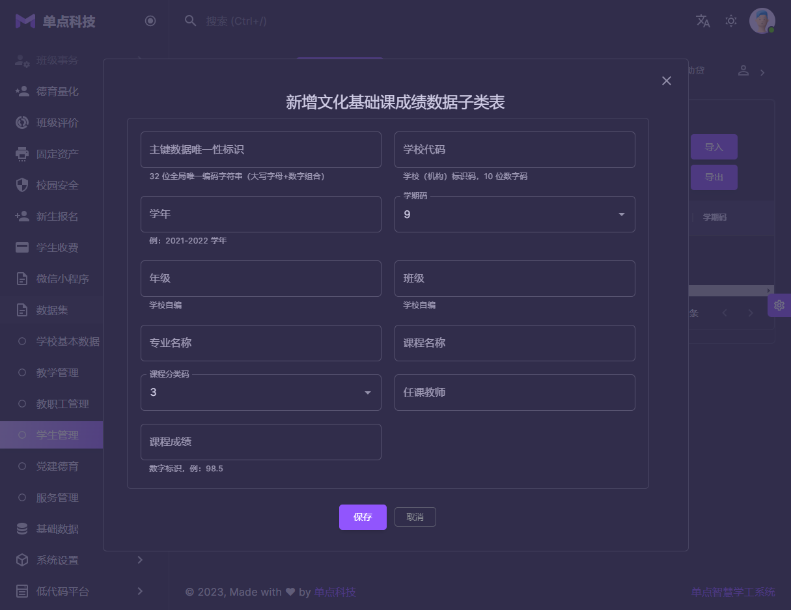
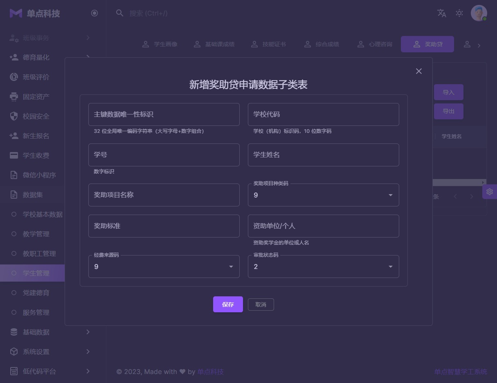

#### 数据交换
本模块是职校版本功能，中小学没有此项功能
1.  数据集管理: 总计47个数据集需要上报. 可以通过远程数据同步的访问，获取第三方业务系统的数据，然后进行数据清洗和过滤，得到有效和精确的需要上报教育部的数据集合.
2.  代码集管理: 【全国职业教育智慧大脑院校中台-中职数据标准及接口规范】文件里面所规定和描述的代码集合
3.  数据库连接池: 设置第三方数据集合，用于同步过滤清洗第三方业务系统数据，以达到【全国职业教育智慧大脑院校中台-中职数据标准及接口规范】文件所要求的数据元素
4.  数据同步任务: 可以配置每一个数据集合的同步时间和周期，以及查看到每次同步数据的日志信息，方便检验哪些数据不符合要求，从而为数据修正提供一个有效的依据
5.  数据同步日志: 数据同步的日志信息

|  |  |
|------------------------------------------|------------------------------------------|
|  |  |
|  |  |
|  |  |
|  |  |
|  |  |
|  |  |
