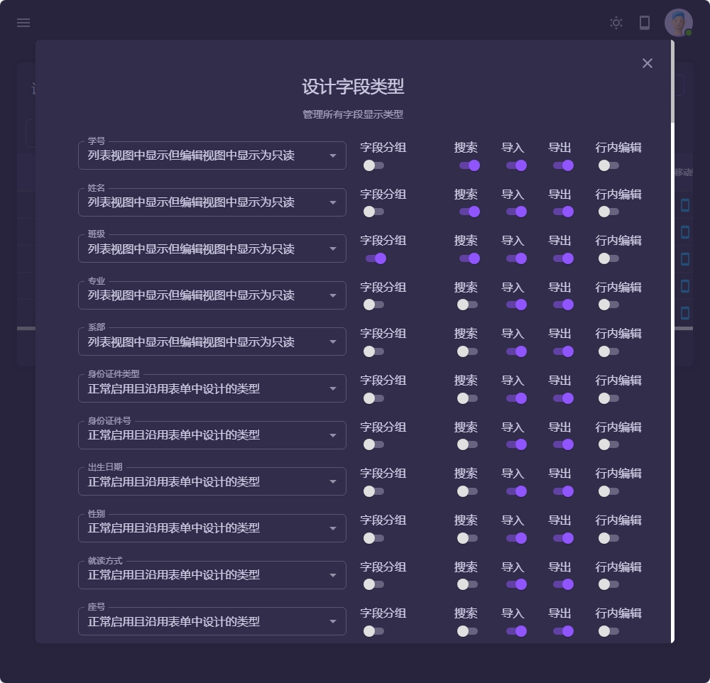
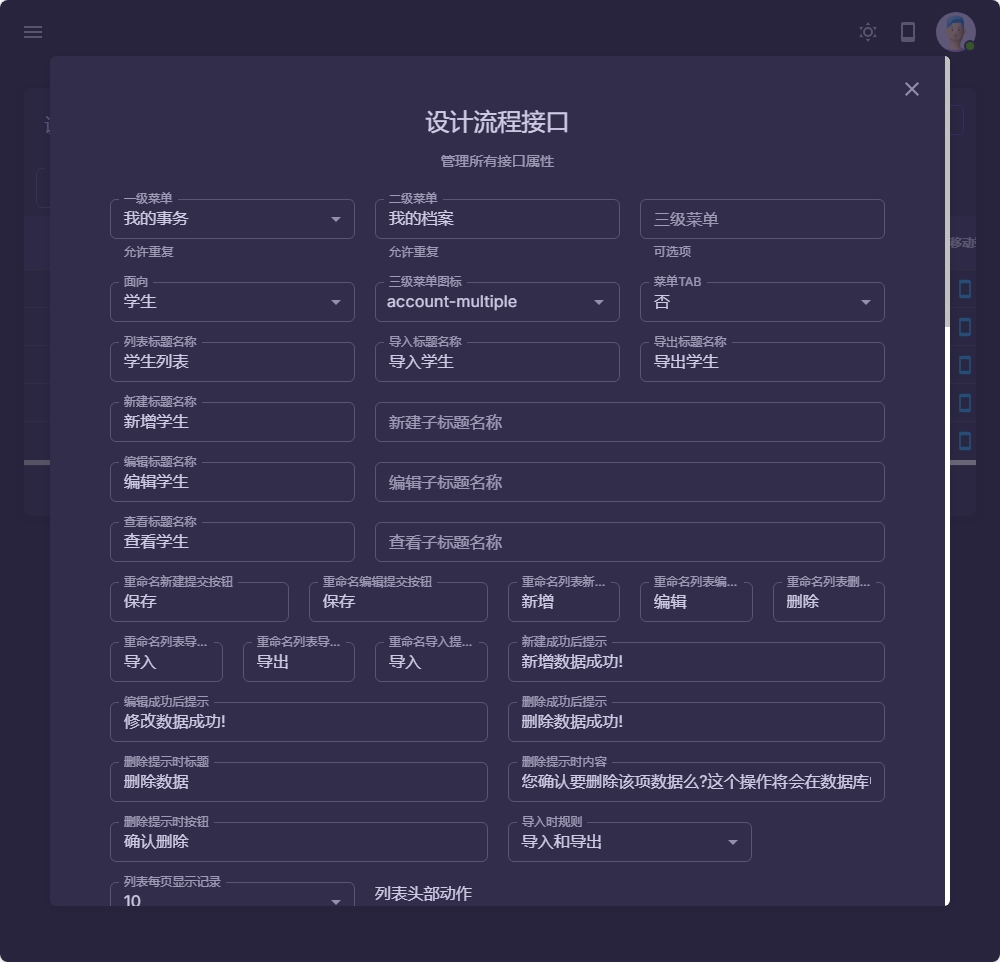
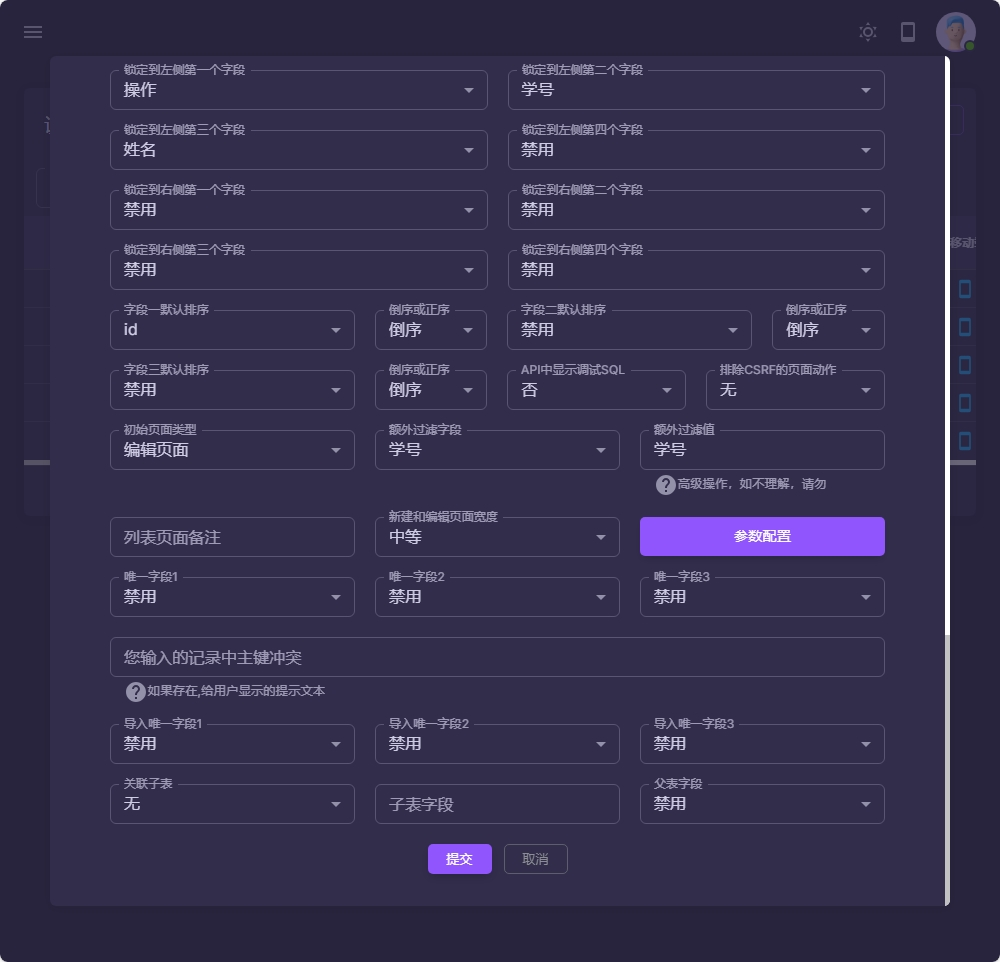
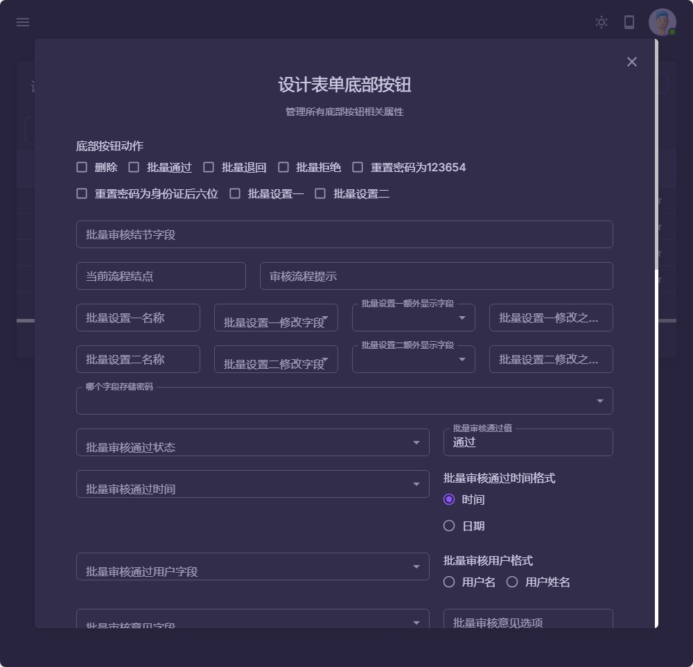
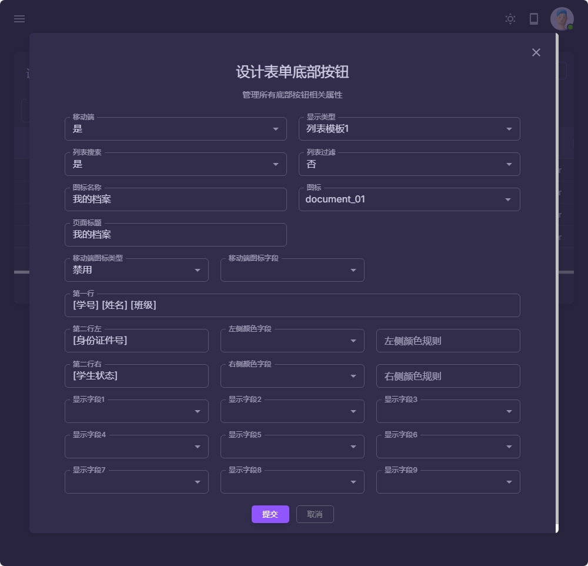

### 流程说明
当前页面为学生表单的流程列表, 总计有五个流程
1 每一个流程,可以对应一个菜单
2 每个流程之间,可以存在数据审核的先后顺序,也可以不存在.
3 每个流程之间的数据审核的逻辑关系是通过每个流程所配置的查询条件来实现的
4 每个流程的步骤属性就是建立流程的先后顺序,步骤之间并不存在先后顺序
5 每个流程可以对每个字段进行单独配置属性
6 每个流程可以定义信息, 设置判断条件, 添加所属角色(学生,老师,班主任,年段长,系部,宿舍管理员等.)
7 每个流程支持批量审核操作
8 每个流程支持配置移动端的显示界面

|  |  |
|------------------------------------------|------------------------------------------|
|  |  |
|  |  |
