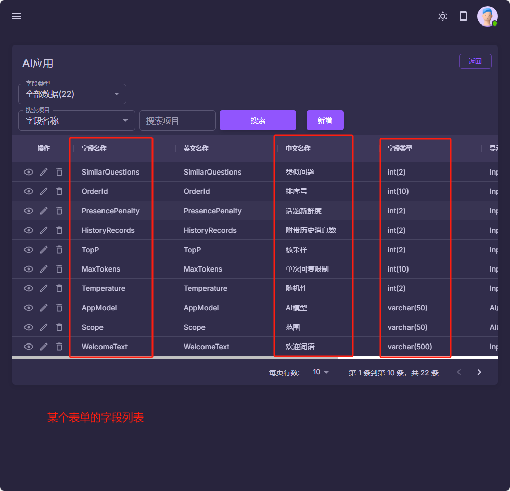
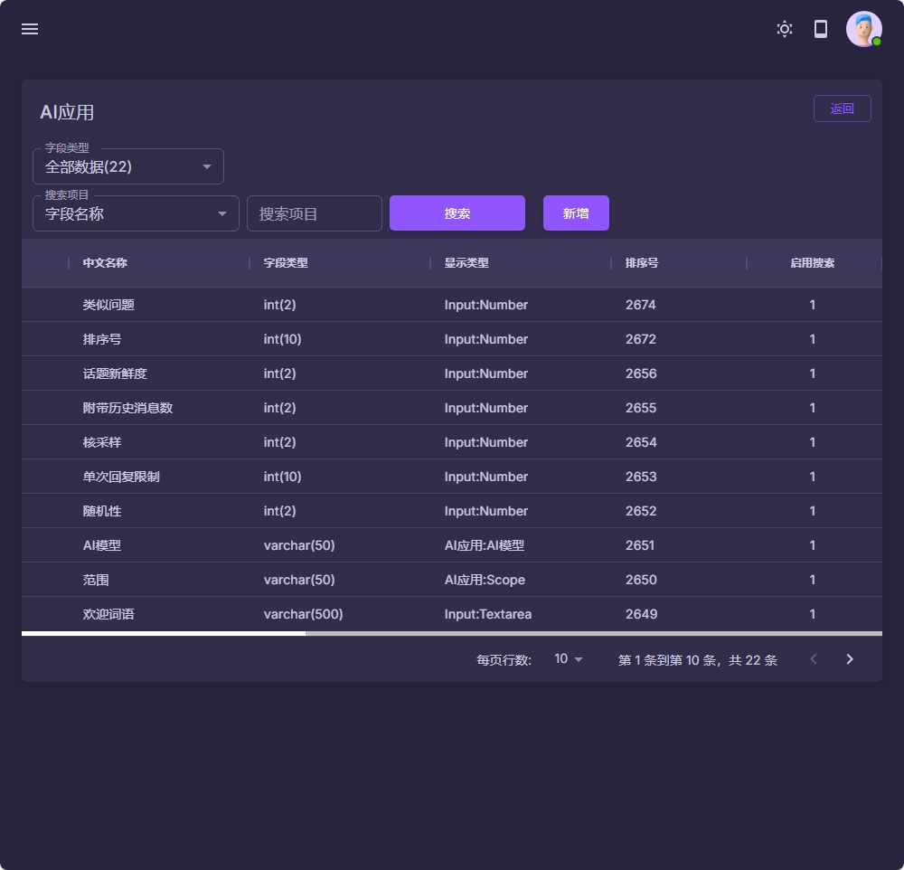
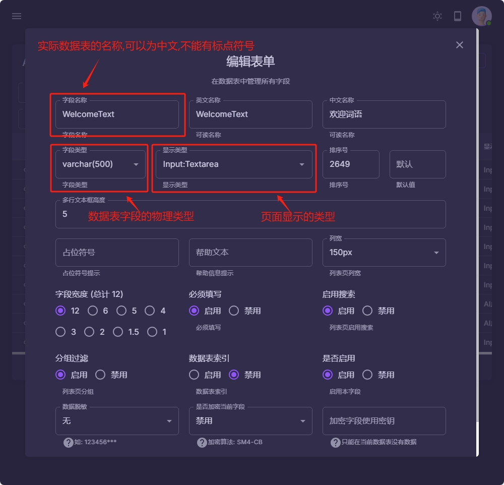
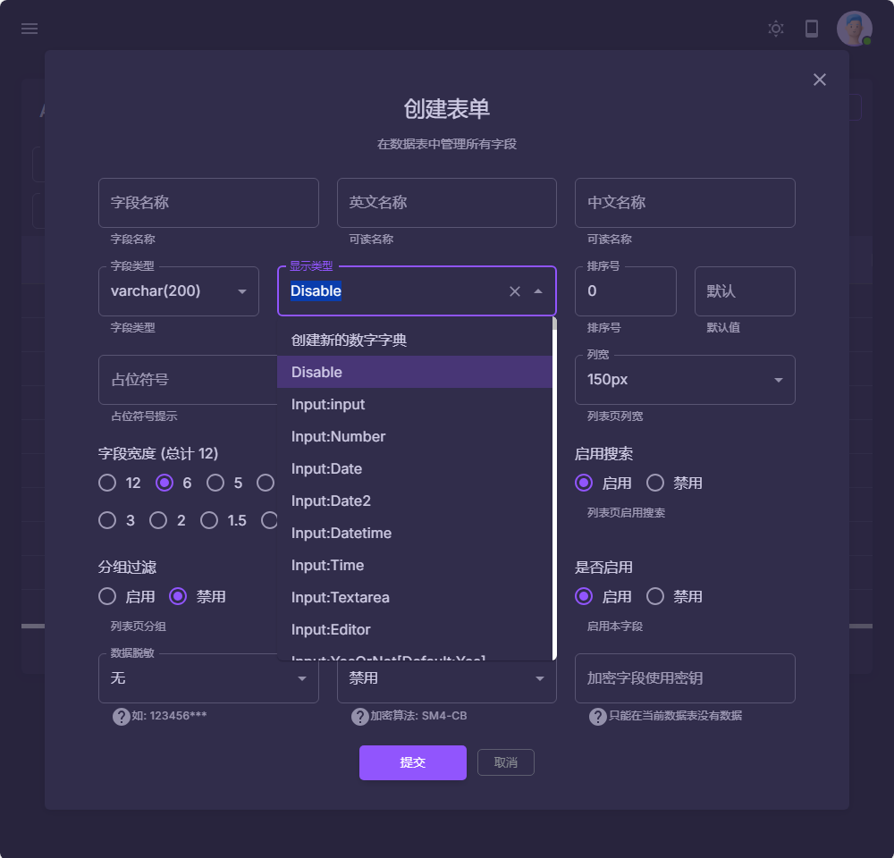
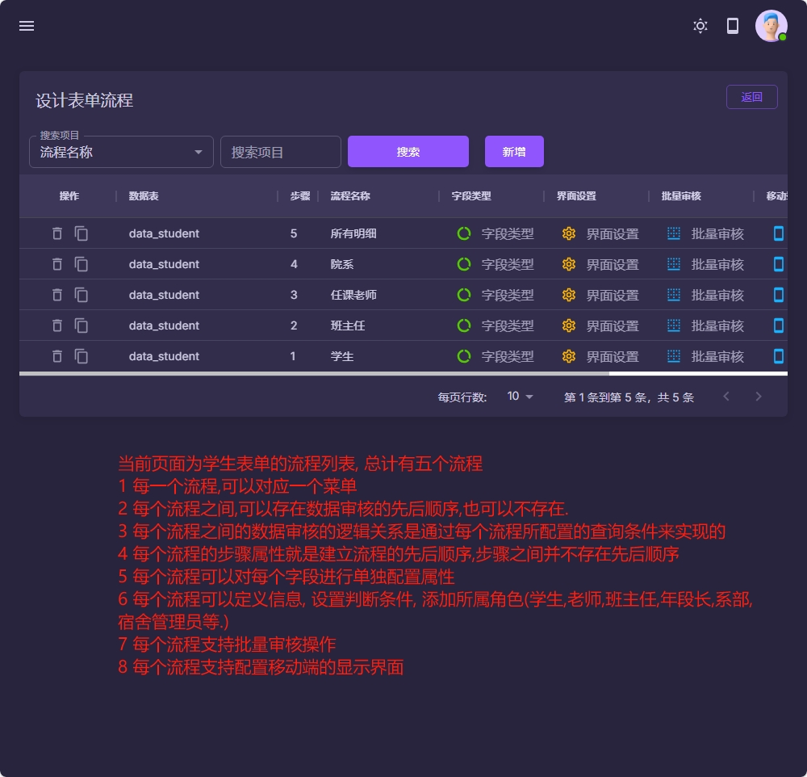

#### 概念说明
- 表单: 对应一个物理存在的数据表
- 字段: 表单的字段就是数据表的字段
- 流程: 一个可以操作的功能模块,可以加在菜单里面

#### 注意事项
1. 新建表单名称的时候,只允许小写的英文字母和下划线_,不能使用标点符号
2. 新建字段的时候,允许使用大小写的英文字母或是中文以及下划线_,不能使用标点符号

|  |  |
|------------------------------------------|------------------------------------------|
|  |  |
|  |  |
