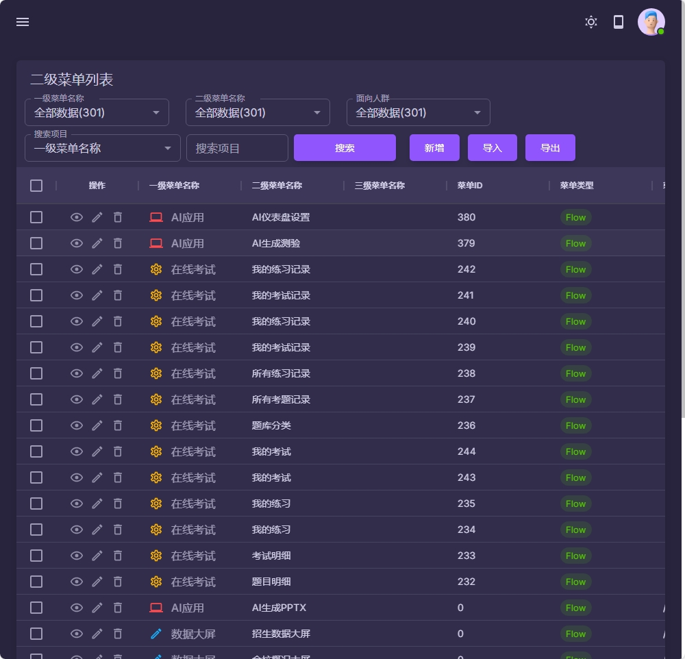
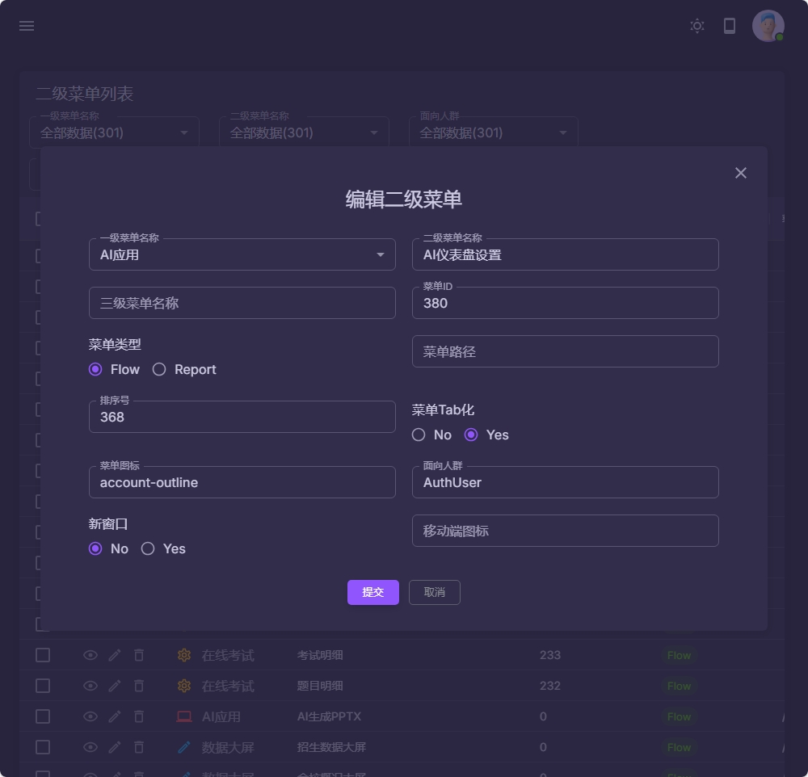
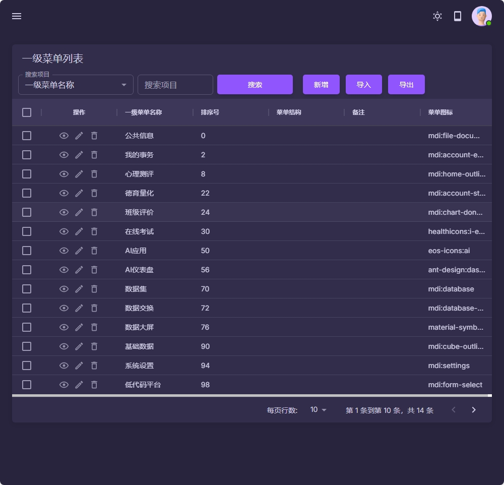
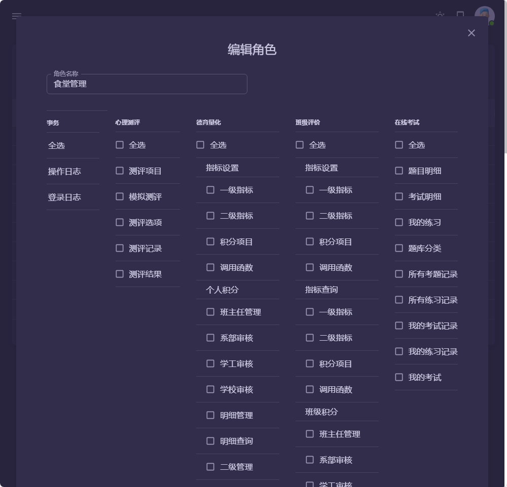

### 概念说明

- 表单: 对应一个物理存在的数据表
- 字段: 表单的字段就是数据表的字段
- 流程: 一个可以操作的功能模块,可以加在菜单里面

### 注意事项
1. 一级菜单需要单独手动去建立
2. 二级菜单不需要单独建立,而是在表单的[设计流程]中的[界面设置]中设置,在界面中选择完一级菜单,填写二级菜单的名称,保存以后就可以了
3. 三级菜单填写完成以后, 会自动在二级菜单的下面进行合并出来一个三级菜单区域. 三级菜单并不在左侧菜单区域,而是以TAB的形式显示在主界面的顶部
4. 完成以上操作,就可以在二级菜单中看到数据了, 最后需要分配一下权限, 刷新或是重新登录一下, 就可以看到新增加的菜单了.

5. 这部分操作比较复杂, 后续会给大家录制一些视频教程.

|  |  |
|------------------------------------------|------------------------------------------|
|  |  |
